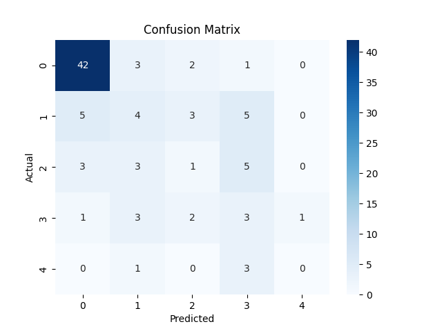

# ❤️ Heart Disease Prediction – SDG 3

This project uses a machine learning model to predict heart disease risk, contributing to **UN SDG 3: Good Health and Well-being**.

## 💡 About the Project

- **Model**: Logistic Regression
- **Dataset**: UCI Heart Disease (ID 45)
- **Tools**: Python, Google Colab, scikit-learn, seaborn

## 📊 Results

Model performance evaluated using classification report and confusion matrix.

## ⚖️ Ethical Reflection

The model may carry bias due to underrepresented groups in the dataset. Further improvements will involve broader data sources.

## 🚀 Open the Notebook

[Open in Colab](https://colab.research.google.com/github/Bkibiwot73/heart-disease-sdg3/blob/main/Heart_Disease_Prediction_SDG3.ipynb)

